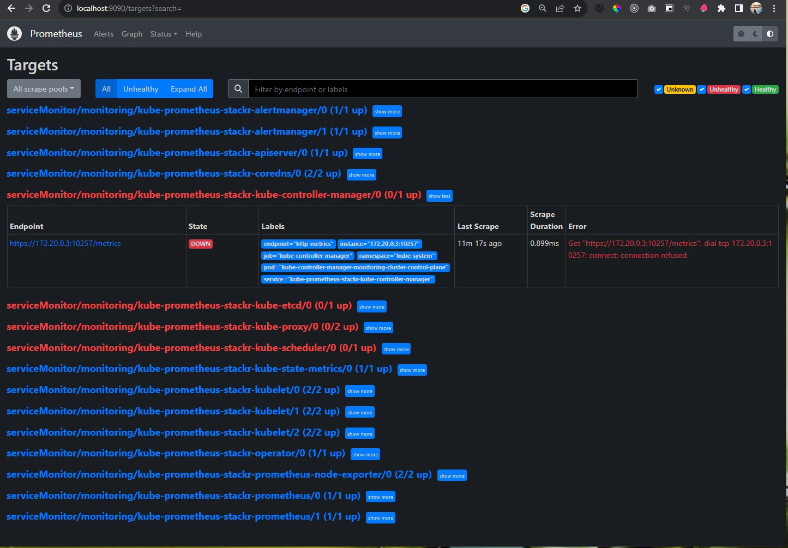
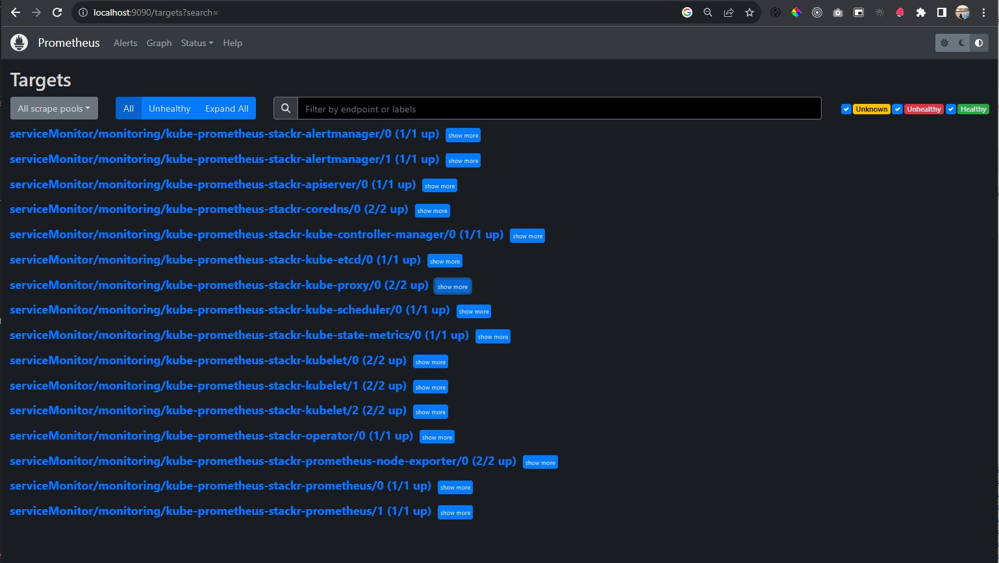
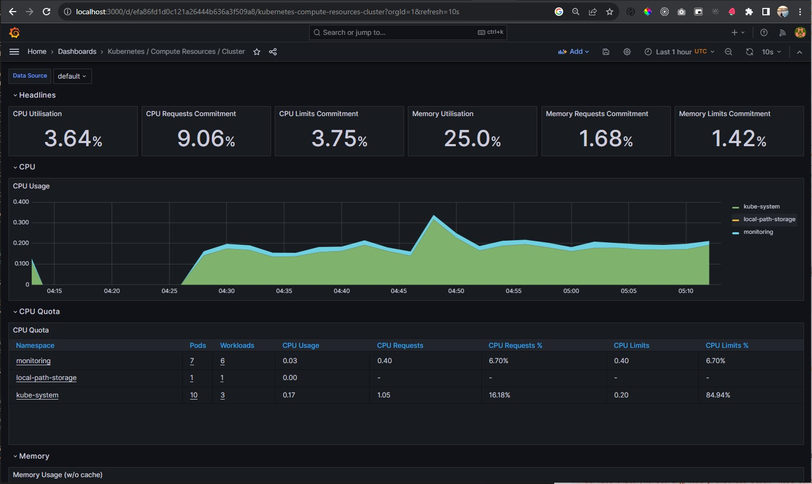

# Kubernetes Clusters (Kind) Monitoring
Local Kubernetes clusters kind monitoring with terraform and promotheus, grafana, helm chart kube-promotheus-stack by promotheus-community

## Installation
```
# Install local kubernetes kind
# Install kubectl
# Install terraform
```

## Terraform Init

```
$ terraform init

Initializing the backend...

Initializing provider plugins...
- Finding tehcyx/kind versions matching "~> 0.2.1"...
- Finding latest version of hashicorp/helm...
- Finding latest version of hashicorp/kubernetes...
- Installing hashicorp/helm v2.11.0...
- Installed hashicorp/helm v2.11.0 (signed by HashiCorp)
- Installing hashicorp/kubernetes v2.23.0...
- Installed hashicorp/kubernetes v2.23.0 (signed by HashiCorp)
- Installing tehcyx/kind v0.2.1...
- Installed tehcyx/kind v0.2.1 (self-signed, key ID 15BD4444F5DB9E44)

...

Terraform has been successfully initialized!

You may now begin working with Terraform. Try running "terraform plan" to see
any changes that are required for your infrastructure. All Terraform commands
should now work.

If you ever set or change modules or backend configuration for Terraform,
rerun this command to reinitialize your working directory. If you forget, other
commands will detect it and remind you to do so if necessary.
```

## Terraform Plan
```
$ terraform plan
```

## Terraform Apply
```
$ terraform apply

Do you want to perform these actions?
  Terraform will perform the actions described above.
  Only 'yes' will be accepted to approve.

  Enter a value: yes

kind_cluster.default: Creating...
kind_cluster.default: Still creating... [10s elapsed]
kind_cluster.default: Still creating... [20s elapsed]
kind_cluster.default: Still creating... [30s elapsed]
kind_cluster.default: Still creating... [40s elapsed]
kind_cluster.default: Creation complete after 48s [id=monitoring-cluster-]
helm_release.kube_prometheus: Creating...
helm_release.kube_prometheus: Still creating... [10s elapsed]
helm_release.kube_prometheus: Still creating... [20s elapsed]
helm_release.kube_prometheus: Still creating... [30s elapsed]
helm_release.kube_prometheus: Still creating... [40s elapsed]
helm_release.kube_prometheus: Still creating... [50s elapsed]
helm_release.kube_prometheus: Still creating... [1m0s elapsed]
helm_release.kube_prometheus: Still creating... [1m10s elapsed]
helm_release.kube_prometheus: Still creating... [1m20s elapsed]
helm_release.kube_prometheus: Still creating... [1m30s elapsed]
helm_release.kube_prometheus: Still creating... [1m40s elapsed]
helm_release.kube_prometheus: Still creating... [1m50s elapsed]
helm_release.kube_prometheus: Still creating... [2m0s elapsed]
helm_release.kube_prometheus: Still creating... [2m10s elapsed]
helm_release.kube_prometheus: Still creating... [2m20s elapsed]
helm_release.kube_prometheus: Still creating... [2m30s elapsed]
helm_release.kube_prometheus: Still creating... [2m40s elapsed]
helm_release.kube_prometheus: Still creating... [2m50s elapsed]
helm_release.kube_prometheus: Still creating... [3m0s elapsed]
helm_release.kube_prometheus: Still creating... [3m10s elapsed]
helm_release.kube_prometheus: Still creating... [3m20s elapsed]
helm_release.kube_prometheus: Still creating... [3m30s elapsed]
helm_release.kube_prometheus: Still creating... [3m40s elapsed]
helm_release.kube_prometheus: Creation complete after 3m42s [id=kube-prometheus-stackr]

Apply complete! Resources: 2 added, 0 changed, 0 destroyed.
```

After a few minutes, everything should be up and running:

```
$ kubectl -n monitoring get pod
```
```
NAME                                                         READY   STATUS    RESTARTS   AGE
alertmanager-kube-prometheus-stackr-alertmanager-0           2/2     Running   0          16m
kube-prometheus-stackr-grafana-8477c75b74-ckmk7              3/3     Running   0          17m
kube-prometheus-stackr-kube-state-metrics-6b65574699-wtv7j   1/1     Running   0          17m
kube-prometheus-stackr-operator-865f447868-lhqqd             1/1     Running   0          17m
kube-prometheus-stackr-prometheus-node-exporter-dgtzt        1/1     Running   0          17m
kube-prometheus-stackr-prometheus-node-exporter-jf4rw        1/1     Running   0          17m
prometheus-kube-prometheus-stackr-prometheus-0               2/2     Running   0          16m
```

Get all service at monitoring namespace:
```
$ kubectl -n monitoring get svc
```
```
kubectl -n monitoring get svc
NAME                                              TYPE        CLUSTER-IP      EXTERNAL-IP   PORT(S)                      AGE
alertmanager-operated                             ClusterIP   None            <none>        9093/TCP,9094/TCP,9094/UDP   21m
kube-prometheus-stackr-alertmanager               ClusterIP   10.96.26.192    <none>        9093/TCP,8080/TCP            22m
kube-prometheus-stackr-grafana                    ClusterIP   10.96.236.177   <none>        80/TCP                       22m
kube-prometheus-stackr-kube-state-metrics         ClusterIP   10.96.84.127    <none>        8080/TCP                     22m
kube-prometheus-stackr-operator                   ClusterIP   10.96.203.39    <none>        443/TCP                      22m
kube-prometheus-stackr-prometheus                 ClusterIP   10.96.233.86    <none>        9090/TCP,8080/TCP            22m
kube-prometheus-stackr-prometheus-node-exporter   ClusterIP   10.96.251.187   <none>        9100/TCP                     22m
prometheus-operated                               ClusterIP   None            <none>        9090/TCP                     21m
```

## View Grafana Dashboard
```
$ kubectl -n monitoring port-forward svc/kube-prometheus-stackr-grafana 3000:80

Email/Username : admin
Password: prom-operator
```

## Access Prometheus
```
$ kubectl -n monitoring port-forward svc/kube-prometheus-stackr-prometheus 9090
```

## Troubleshooting
#### Some promotheus targets is DOWN

GET /metrics dial tcp DOWN ` Get "http://<host>:<port>/metrics": dial tcp 172.20.0.3:10249: connect: connection refused` :

```diff
- serviceMonitor/monitoring/kube-prometheus-stackr-kube-controller-manager/0 (0/1 up)
- serviceMonitor/monitoring/kube-prometheus-stackr-kube-etcd/0 (0/1 up)
- serviceMonitor/monitoring/kube-prometheus-stackr-kube-proxy/0 (0/2 up)
- serviceMonitor/monitoring/kube-prometheus-stackr-kube-scheduler/0 (0/1 up)
```



- kube-controller-manager -> bind-address=127.0.0.1 change to bind-address=0.0.0.0  (only do this in production if that port is not accessible from outside of the cluster!)
- kube-scheduler -> bind-address=127.0.0.1 change to bind-address=0.0.0.0  (only do this in production if that port is not accessible from outside of the cluster!)
- etcd -> listen-metrics-urls=http://127.0.0.1:<port> change to listen-metrics-urls=http://127.0.0.1:<port>,http://<cluster IP>:2381 - you can find the cluster IP in the other settings in that same file

https://groups.google.com/g/prometheus-users/c/_aI-HySJ-xM

```
$ docker ps

CONTAINER ID   IMAGE                  COMMAND                  CREATED       STATUS        PORTS                                      NAMES
aa848499510b   kindest/node:v1.27.3   "/usr/local/bin/entr…"   2 hours ago   Up 2 hours    127.0.0.1:12789->6443/tcp                  monitoring-cluster-control-plane
f94239803fdf   kindest/node:v1.27.3   "/usr/local/bin/entr…"   2 hours ago   Up 2 hours    0.0.0.0:80->80/tcp, 0.0.0.0:443->443/tcp   monitoring-cluster-worker

$ docker exec -it monitoring-cluster-control-plane /bin/bash
$ cd /etc/kubernetes/manifests/

$ ls
etcd.yaml  kube-apiserver.yaml  kube-controller-manager.yaml  kube-scheduler.yaml

```
##### Edit kube-controller-manager.yaml
```
$ apt-get update
$ apt-get install vim
$ vim kube-controller-manager.yaml
```
Find `spec.containers.command` `--bind-address=127.0.0.1` change to `--bind-address=0.0.0.0` and save


##### Edit etcd.yaml
```
$ vim etcd.yaml
```
Find `spec.containers.command` `--listen-metrics-urls=http://127.0.0.1:2381` change to `--listen-metrics-urls=http://0.0.0.0:2381` and save

##### Edit kube-scheduler.yaml
```
$ vim kube-scheduler.yaml
```
Find `spec.containers.command` `--bind-address=127.0.0.1` change to `--bind-address=0.0.0.0`, save and exit

##### Edit configmap kube-proxy
```
$ kubectl -n kube-system get cm

NAME                                                   DATA   AGE
coredns                                                1      143m
extension-apiserver-authentication                     6      143m
kube-apiserver-legacy-service-account-token-tracking   1      143m
kube-proxy                                             2      143m
kube-root-ca.crt                                       1      143m
kubeadm-config                                         1      143m
kubelet-config                                         1      143m

$ kubectl edit cm/kube-proxy -n kube-system

...
kind: KubeProxyConfiguration
metricsBindAddress: 0.0.0.0:10249
...

$ kubectl get pod -n kube-system

NAME                                                       READY   STATUS    RESTARTS      AGE
coredns-5d78c9869d-hwbfm                                   1/1     Running   0             148m
coredns-5d78c9869d-j89fn                                   1/1     Running   0             148m
etcd-monitoring-cluster-control-plane                      1/1     Running   0             18m
kindnet-7jl97                                              1/1     Running   1 (18m ago)   148m
kindnet-vnpgx                                              1/1     Running   1 (18m ago)   148m
kube-apiserver-monitoring-cluster-control-plane            1/1     Running   1 (18m ago)   149m
kube-controller-manager-monitoring-cluster-control-plane   1/1     Running   1 (20m ago)   25m
kube-proxy-j8ql5                                           1/1     Running   0             148m
kube-proxy-qcgn2                                           1/1     Running   0             148m
kube-scheduler-monitoring-cluster-control-plane            1/1     Running   0             18m

$ kubectl delete pod kube-proxy-j8ql5 -n kube-system
$ kubectl delete pod kube-proxy-qcgn2 -n kube-system

```

##### Finally we got all promotheus targets UP and running:



### Grafana Dashboard Kubernetes / Compute Resources / Cluster



### Uninstall
```
$ terraform destroy

...
Plan: 0 to add, 0 to change, 2 to destroy.

Do you really want to destroy all resources?
  Terraform will destroy all your managed infrastructure, as shown above.
  There is no undo. Only 'yes' will be accepted to confirm.

  Enter a value: yes
...

```
